```markdown
# SheetXray

<p>
	
	
	
	
	
	
	
	
	
	
	
	
</p>

SheetXray is an enterprise-grade, full-stack spreadsheet intelligence platform. It enables users to securely organize spreadsheets, perform advanced natural language queries using Retrieval-Augmented Generation (RAG), and execute analytical workflows via LangChain AI agents. 

To ensure performance at scale, uploaded spreadsheets are parsed using Pandas, converted into optimized **Parquet columnar storage**, and indexed into a vector database for low-latency semantic search.

---

## 🛠️ System Architecture & Tech Stack

SheetXray is built as a microservices-oriented architecture for scalability and fault isolation.

```mermaid
flowchart LR
    A[User Registration / OTP] --> B[JWT Login Auth]
    B --> C[Express REST API Gateway]
    C -->|Rate Limited by Redis| B
    C -->|Upload Document| D[(Cloudinary Storage)]
    D --> E[FastAPI AI Pipeline]
    E -->|Convert to Parquet| F[Pandas Data Wrangling]
    F -->|Index Embeddings| G[(Vector DB: Chroma/Pinecone)]
    C -->|Natural Language Chat| H[LangChain Agent Logic]
    G -->|RAG Context Match| H
    H -->|Multi-step Reasoning| I[OpenRouter LLM Gateway]
    I -->|WebSocket Stream| J[React 18 / Vite Frontend]

```



### Component Breakdown

| Layer | Technologies | Responsibilities |
| --- | --- | --- |
| **Frontend** | React 18, Vite, React Router, CSS, Axios | Responsive SPA, interactive file/folder directory, real-time streaming chat UI, Razorpay subscription checkout. |
| **Backend Gateway** | Node.js, Express 5, MongoDB, Mongoose, Redis | RBAC Session management (JWT Access/Refresh rotation), Redis-backed OTP registration & login rate-limiting, payment orchestration, webhook validation. |
| **AI / Data Service** | FastAPI, LangChain, Pydantic, Pandas, PyArrow | Async pipeline handling multi-turn conversation memory, spreadsheet-to-Parquet optimization, LangChain agent analytical toolkits, vector store indexing. |
| **Third-Party APIs** | Cloudinary, ImageFlow, OpenRouter, Razorpay | Document object hosting, profile asset optimization, agnostic LLM orchestration (GPT-4/Claude 3), payment gateway processing. |

---

## 🛣️ API Reference

All routes are mounted under `/api/v1`. Authenticated routes expect an `Authorization: Bearer <JWT_TOKEN>` header.

### 1. Gateway Authentication & Users (`/api/v1/users`)

* `POST /otpsender` - Generates a secure cryptographic OTP via Node.js crypto primitives and sends via SMTP. *(Rate-limited via Redis)*
* `POST /register` - Verifies email OTP and initializes user accounts.
* `POST /login` - Issues short-lived access tokens and sets secure refresh tokens. *(Rate-limited via Redis)*
* `POST /refreshAccessToken` - Generates a new access token via refresh token rotation.
* `POST /logout` - Revokes tokens and clears sessions.
* `GET /profile` - Fetches authenticated user context.
* `PATCH /updateprofileavatar` - Multi-part upload handler via Multer routing to the **ImageFlow** microservice for real-time asset optimization.

### 2. Folder & Document Asset Management (`/api/v1/folders` & `/api/v1/sheets`)

* `POST /folders/createfolder` - Provisions a virtual user workspace.
* `GET /folders/getalluserfolders` - Lists user-owned directories.
* `DELETE /folders/deletefolder/:folderid` - Purges a folder.
* `GET /folders/getallsheetsinfolder/:folderid` - Fetches sheet documents tied to a workspace directory.
* `POST /sheets/uploadsheet/:folderid` - Standard multi-part file pipeline routing binary data to Cloudinary CDN and indexing tasks to FastAPI.

### 3. Payment Processing Gateway (`/api/v1/payments`)

* `POST /createorder` - Generates verified Razorpay orders mapping to structural subscription tiers.
* `POST /verifypayment` - Validates synchronous transaction checkouts via `HMAC-SHA256` signature verification.
* `POST /webhook` - Public endpoint reading raw buffers before `express.json()` execution. Implements idempotent checks processing exclusively `payment.captured` events.

### 4. Machine Learning & RAG Microservice (`/ai/v1`)

* `POST /index` - Chunks document metrics and embeds mathematical indices into vector stores.
* `POST /query` - Stateless transactional query running semantic calculations against Parquet sources.
* `POST /chat` - Executes a structured multi-turn conversation with LangChain agent memory tracking.
* `WebSocket /ws/chat/:sessionid` - Direct persistent communication layer used for raw LLM token streaming.
* `DELETE /cache/:folderid` - Clears vector indexes and embeddings caches stored inside Redis.

---

## ⚙️ Environment Configuration

### Gateway Backend (`/.env`)

```env
PORT=3000
CORS_ORIGIN=http://localhost:5173
MONGODB_URI=mongodb://127.0.0.1:27017/sheetxray
JWT_SECRET=your_access_cryptographic_secret
JWT_REFRESH_SECRET=your_refresh_cryptographic_secret
REDIS_HOST=127.0.0.1
REDIS_PORT=6379
cloudinary_name=your_cloud_metadata_name
cloudinary_api_key=your_api_key
cloudinary_api_secret=your_api_secret
EMAIL_USER=your_smtp_gateway_profile@gmail.com
EMAIL_PASS=your_google_app_specific_password
RAZORPAY_KEY_ID=rzp_live_or_test_key
RAZORPAY_KEY_SECRET=rzp_secret
RAZORPAY_WEBHOOK_SECRET=rzp_webhook_secret
AI_SERVICE_URL=http://localhost:8000

```

### AI Service Processing Engine (`/ai_service/.env`)

```env
OPENROUTER_API_KEY=your_openrouter_token
OPENROUTER_MODEL=openai/gpt-4-turbo
OPENROUTER_EMBEDDING_MODEL=openai/text-embedding-3-small
VECTOR_DB_TYPE=chroma  # Options: chroma | pinecone
CHROMA_HOST=localhost
CHROMA_PORT=8001
MONGODB_URI=mongodb://127.0.0.1:27017/sheetxray
REDIS_HOST=127.0.0.1
REDIS_PORT=6379
CHUNK_SIZE=1000
CHUNK_OVERLAP=100

```

### Frontend Environment Framework (`/frontend/.env`)

```env
VITE_API_BASE_URL=http://localhost:3000/api/v1
VITE_AI_WS_URL=ws://localhost:8000

```

---

## 💡 AI Core Capabilities & Agent Tooling

The AI framework relies on smart **LangChain Autonomous Routing Agents** capable of reading structures using distinct tool operations:

* **Mathematical Reductions:** Calculates complex groupings (`SUM`, `AVERAGE`, `COUNT`, `MIN/MAX` metrics) straight out of Parquet streams.
* **Context Window Management:** Chunks long sheets structurally to isolate lookups within strict LLM token limit boundaries.
* **Self-Correction Logic:** Detects layout anomalies or formatting issues, falling back gracefully by proposing clarifying prompts.

### Sample Workflow Execution

```json
// Query sent via WebSocket protocol: "Compare Q1 and Q2 revenue anomalies"
[Agent Framework Trace Logic]:
User writes a query in the chat interface.

RAG finds relevant files and data chunks using vector search.

Agent does calculations and filters data using Pandas tools.

backend streams the final response back to the user interface.

```

---


```