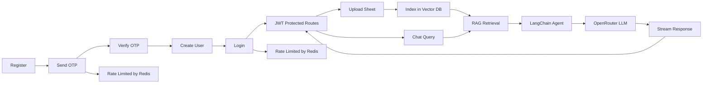

# SheetXray

<p>
	
	
	
	
	
	
	
	
	
	
	
	
</p>

SheetXray is an advanced full-stack spreadsheet assistant platform that enables users to register, log in, organize files into folders, upload sheet documents, and leverage AI-powered RAG (Retrieval Augmented Generation) agents for intelligent query/chat workflows. The application features a modern React frontend with Vite, a robust Express backend with JWT authentication, a dedicated Python FastAPI service for AI operations with LangChain and OpenRouter integration, and integrated payment processing via Razorpay.

## Highlights

### Frontend

- Modern React 18 UI built with Vite for fast development
- User authentication with JWT tokens (login/register/logout)
- Responsive layout with navigation and sidebar
- Dashboard with file management and folder organization
- Profile management with avatar uploads via ImageFlow
- Integration with Razorpay payment gateway for premium subscriptions
- Protected routes for authenticated users
- Chat interface for AI-powered spreadsheet queries

### Backend (Express)

- User auth with JWT access and refresh tokens
- OTP-based registration flow
- OTP generation using Node.js crypto module
- OTP email delivery via Nodemailer SMTP
- Welcome email delivery after successful registration
- Redis-backed rate limiting for login and OTP requests
- Folder management for organizing uploaded sheets
- Sheet file upload support through Multer and Cloudinary
- User profile picture management via ImageFlow service
- Razorpay order creation and payment verification endpoints
- Protected routes for user, folder, and sheet operations
- Integration with Python FastAPI AI service for intelligent queries

### AI Service (Python FastAPI)

- FastAPI-based microservice for AI and RAG operations
- LangChain integration for advanced chain-of-thought reasoning
- OpenRouter API integration for flexible LLM model selection
- RAG (Retrieval Augmented Generation) capabilities for context-aware responses
- Intelligent agent framework for multi-step reasoning
- Vector embeddings for semantic search and document retrieval
- Sheet content processing and indexing
- Real-time chat interface powered by AI agents
- Support for multiple AI models through OpenRouter

> Login and OTP endpoints are rate-limited through Redis to reduce abuse and repeated attempts.

## Flow At A Glance



### Authentication & File Upload Flow

1. User registers with OTP verification
2. Login generates JWT tokens with rate limiting
3. Sheets uploaded and stored on Cloudinary
4. Sheet content indexed for AI search

### AI & RAG Query Flow

1. User sends query through chat interface
2. Query embedded into vector space
3. Vector similarity search retrieves relevant sheet sections
4. LangChain agent processes query + retrieved context
5. Agent routes to appropriate OpenRouter LLM
6. Response streamed back to user in real-time

## Tech Stack

### Frontend

- React 18
- Vite (build tool and dev server)
- React Router for client-side routing
- Context API for state management
- CSS for styling
- Axios or Fetch API for HTTP requests

### Backend (Express)

- Node.js
- Express 5
- MongoDB and Mongoose
- Node.js crypto module for OTP generation
- Redis via ioredis
- Multer for multipart form handling
- Cloudinary for spreadsheet file storage
- Nodemailer for OTP email sending
- JWT and cookie-parser for authentication
- Razorpay for payment processing
- ImageFlow for user profile picture management

### AI Service (Python)

- FastAPI (high-performance async web framework)
- LangChain (orchestration framework for LLM applications)
- OpenRouter API client (unified LLM provider)
- Pydantic (data validation)
- Vector databases (Pinecone/Chroma for embeddings)
- Document processing libraries (pdf2image, python-pptx, openpyxl for sheet parsing)
- Async/await for concurrent request handling

### External Services & Integrations

- **ImageFlow**: Self-made media management service for user profile pictures ([GitHub](https://github.com/yourusername/imageflow))
- **Cloudinary**: Cloud storage for spreadsheet files and documents
- **OpenRouter**: Unified API for accessing multiple LLM providers
- **Razorpay**: Payment gateway for subscription processing
- **Nodemailer**: Email delivery service

### Infrastructure

- Docker and Docker Compose
- MongoDB container
- Redis container
- Multi-stage builds for optimized images

## API Base

All routes are mounted under:

`/api/v1`

Example:

`POST /api/v1/users/login`

## Routes

### User Routes

| Method | Endpoint                            | Auth   | Purpose                                                                   |
| ------ | ----------------------------------- | ------ | ------------------------------------------------------------------------- |
| POST   | `/api/v1/users/otpsender`           | Public | Send OTP to the provided email via Nodemailer and apply OTP rate limiting |
| POST   | `/api/v1/users/register`            | Public | Register a user after OTP verification                                    |
| POST   | `/api/v1/users/login`               | Public | Log in and issue tokens with login rate limiting                          |
| POST   | `/api/v1/users/refreshAccessToken`  | Public | Refresh the access token                                                  |
| POST   | `/api/v1/users/logout`              | JWT    | Log out the current user                                                  |
| GET    | `/api/v1/users/profile`             | JWT    | Get the logged-in user profile                                            |
| PATCH  | `/api/v1/users/updateprofileavatar` | JWT    | Update user avatar via ImageFlow service                                  |
| POST   | `/api/v1/users/updatepassword`      | JWT    | Update the user password                                                  |
| PATCH  | `/api/v1/users/updateemail`         | JWT    | Update the user email                                                     |

### Folder Routes

| Method | Endpoint                                         | Auth | Purpose                               |
| ------ | ------------------------------------------------ | ---- | ------------------------------------- |
| POST   | `/api/v1/folders/createfolder`                   | JWT  | Create a folder                       |
| GET    | `/api/v1/folders/getalluserfolders`              | JWT  | List all folders for the current user |
| DELETE | `/api/v1/folders/deletefolder/:folderid`         | JWT  | Delete a folder                       |
| GET    | `/api/v1/folders/getallsheetsinfolder/:folderid` | JWT  | List all sheets in a folder           |
| POST   | `/api/v1/folders/query/:folderid`                | JWT  | Query a folder                        |

### Sheet Routes

| Method | Endpoint                               | Auth | Purpose                         |
| ------ | -------------------------------------- | ---- | ------------------------------- |
| POST   | `/api/v1/sheets/uploadsheet/:folderid` | JWT  | Upload a sheet file to a folder |

### Payment Routes

| Method | Endpoint                         | Auth   | Purpose                                                       |
| ------ | -------------------------------- | ------ | ------------------------------------------------------------- |
| POST   | `/api/v1/payments/createorder`   | JWT    | Create a Razorpay order for selected subscription type        |
| POST   | `/api/v1/payments/verifypayment` | JWT    | Verify Razorpay signature and update user subscription data   |
| POST   | `/api/v1/payments/webhook`       | Public | Receive Razorpay payment events and process captured payments |

### AI & RAG Routes (FastAPI)

| Method    | Endpoint                    | Auth | Purpose                                                     |
| --------- | --------------------------- | ---- | ----------------------------------------------------------- |
| POST      | `/ai/v1/chat`               | JWT  | Send a message to the AI agent for real-time chat responses |
| POST      | `/ai/v1/query`              | JWT  | Query spreadsheet data using RAG with context awareness     |
| POST      | `/ai/v1/index`              | JWT  | Index uploaded sheets for RAG vector embeddings             |
| GET       | `/ai/v1/history/:folderid`  | JWT  | Retrieve chat history for a specific folder                 |
| POST      | `/ai/v1/analyze`            | JWT  | Analyze sheet data and provide insights                     |
| WebSocket | `/ai/v1/ws/chat/:sessionid` | JWT  | WebSocket connection for real-time streaming responses      |
| DELETE    | `/ai/v1/cache/:folderid`    | JWT  | Clear RAG cache and embeddings for a folder                 |

### AI & RAG Workflow

The AI service powers intelligent spreadsheet analysis through the following workflow:

1. **Document Ingestion**: Uploaded sheet files are processed and converted to text/structured data
2. **Embedding Generation**: LangChain chunks the data and generates vector embeddings via OpenRouter embeddings API
3. **Vector Storage**: Embeddings are stored in Chroma/Pinecone vector database for efficient similarity search
4. **Query Processing**: User queries are embedded and matched against stored vectors
5. **Context Retrieval**: Top-k relevant chunks are retrieved from the vector store (RAG context)
6. **Agent Reasoning**: LangChain agents combine user query + RAG context + available tools for multi-step reasoning
7. **LLM Response**: OpenRouter API calls the selected LLM model with augmented context
8. **Response Streaming**: Real-time streaming responses via WebSocket to frontend

### AI Agent Capabilities

- **Multi-step Reasoning**: Agents can break down complex queries into sub-queries
- **Tool Integration**: Agents can use external tools for calculations, data transformations
- **Memory Management**: Maintains conversation context and session state
- **Context-Aware Responses**: Uses RAG to ground responses in actual spreadsheet data
- **Error Handling**: Graceful fallbacks and clarifying questions for ambiguous queries
- **Model Flexibility**: Seamless switching between different LLM providers via OpenRouter

### OpenRouter Integration

SheetXray uses OpenRouter to provide access to multiple LLM models:

- **Supported Models**: GPT-4, Claude 3, Mixtral, Llama 2, and many more
- **Unified API**: Single interface for model selection and cost management
- **Fallback Handling**: Automatic fallback to alternative models if primary fails
- **Usage Tracking**: Monitor token usage and costs per model
- **A/B Testing**: Easy model comparison for performance tuning

### Payment Flow

1. Client sends `POST /api/v1/payments/createorder` with body `{ "type": "premiumlifetime" }` or another supported plan value used by the frontend.
2. Backend creates a Razorpay order in INR and returns order payload to the client.
3. Client opens Razorpay Checkout using the returned order details.
4. After successful checkout, client sends `razorpay_order_id`, `razorpay_payment_id`, and `razorpay_signature` to `POST /api/v1/payments/verifypayment`.
5. Backend verifies signature with `HMAC-SHA256` using `RAZORPAY_KEY_SECRET`.
6. On valid signature, backend records payment and updates user subscription state.

### Webhook Handling

Razorpay can also notify the backend directly through `POST /api/v1/payments/webhook`.

1. The webhook route is mounted before `express.json()` so the request body stays raw.
2. The backend validates the webhook using the `x-razorpay-signature` header and `RAZORPAY_WEBHOOK_SECRET`.
3. Only the `payment.captured` event is processed for subscription updates.
4. The backend fetches the original Razorpay order, checks the amount, and creates a `Payment` record.
5. The user record is then updated with the subscription type and expiry date.
6. If the same payment is received again, the duplicate payment ID is ignored and the request is treated as already processed.

### If Payment Is Not Completed

If the user closes the Razorpay checkout, cancels the payment, or the payment fails, then:

1. `verifypayment` is never completed successfully.
2. The `payment.captured` webhook is not handled for that transaction.
3. No `Payment` record is created.
4. The user subscription remains unchanged.

## Environment Variables

### Backend Environment (.env in project root)

Create a `.env` file in the project root with values similar to:

```env
PORT=3000
MONGODB_URI=your_mongodb_connection_uri
JWT_SECRET=your_access_secret
JWT_EXPIRES_IN=1d
JWT_REFRESH_SECRET=your_refresh_secret
JWT_REFRESH_EXPIRES_IN=7d
REDIS_HOST=your_redis_host
REDIS_PORT=6379
REDIS_PASSWORD=
cloudinary_name=your_cloud_name
cloudinary_api_key=your_api_key
cloudinary_api_secret=your_api_secret
EMAIL_USER=your_email@gmail.com
EMAIL_PASS=your_email_app_password
RAZORPAY_KEY_ID=your_razorpay_key_id
RAZORPAY_KEY_SECRET=your_razorpay_key_secret
RAZORPAY_WEBHOOK_SECRET=your_razorpay_webhook_secret
AI_SERVICE_URL=your_ai_service_url
```

For Gmail SMTP, use a Google App Password in `EMAIL_PASS` instead of your normal account password.

### AI Service Environment (.env in ai_service/ directory or Python settings)

Create `.env` or update your Python environment with:

```env
OPENROUTER_API_KEY=your_openrouter_api_key
OPENROUTER_EMBEDDING_MODEL=openai/text-embedding-3-small
VECTOR_DB_TYPE=chroma  # or pinecone
CHROMA_HOST=your_chroma_host
CHROMA_PORT=8001
PINCONE_API_KEY=your_pinecone_api_key
PINCONE_ENVIRONMENT=your_environment
PINCONE_INDEX_NAME=sheetxray
MONGODB_URI=your_mongodb_connection_uri
REDIS_HOST=your_redis_host
REDIS_PORT=6379
LOG_LEVEL=INFO
EMBEDDING_DIMENSION=1536
CHUNK_SIZE=1000
CHUNK_OVERLAP=100
MAX_RETRIEVED_CHUNKS=5
```

### Frontend Environment (.env in frontend/ directory)

Create a `.env` file in the `frontend/` directory:

```env
VITE_API_BASE_URL=your_api_base_url
VITE_AI_WS_URL=your_ai_ws_url
```


## Project Structure

```
SheetXray/
├── frontend/                          # React Vite application
│   ├── src/
│   │   ├── components/               # Reusable UI components
│   │   │   ├── layout/              # Layout wrapper
│   │   │   ├── pages/               # Page components (Auth, Dashboard, Home)
│   │   │   ├── Router/              # Routing logic (Protected routes)
│   │   │   ├── sections/            # Feature sections (Hero, Chat, Files, etc.)
│   │   │   └── ui/                  # UI components (Navbar, Footer)
│   │   ├── Context/                 # React Context for state
│   │   │   ├── LoginContext.jsx
│   │   │   └── Hookcustom/          # Custom hooks
│   │   ├── App.jsx
│   │   ├── main.jsx
│   │   └── index.css
│   ├── vite.config.js
│   ├── package.json
│   └── Dockerfile                   # Frontend container image
│
├── src/                               # Express backend
│   ├── controllers/                 # Route handlers
│   │   ├── user.controller.js
│   │   ├── folder.controller.js
│   │   ├── sheet.controller.js
│   │   ├── payment.controller.js
│   │   └── otp.controller.js
│   ├── middlewares/                 # Express middleware
│   │   ├── auth.middleware.js       # JWT validation
│   │   ├── verifyotp.middleware.js  # OTP verification
│   │   ├── multer.middleware.js     # File upload
│   │   └── ratelim.middleware.js    # Rate limiting
│   ├── models/                      # Mongoose schemas
│   │   ├── user.model.js
│   │   ├── folder.model.js
│   │   ├── sheet.model.js
│   │   ├── payment.model.js
│   │   └── qachat.model.js
│   ├── routes/                      # API route definitions
│   │   ├── user.routes.js
│   │   ├── folder.routes.js
│   │   ├── sheet.routes.js
│   │   └── payment.route.js
│   ├── utils/                       # Helper utilities
│   │   ├── asyncHandler.js         # Async error wrapper
│   │   ├── errorhandler.js         # Error handling
│   │   ├── responseHandler.js      # Standardized responses
│   │   ├── uploadoncloudinary.js   # Cloudinary integration
│   │   ├── mailtransport.js        # Email configuration
│   │   ├── razorpay.js             # Razorpay utilities
│   │   ├── cron.js                 # Scheduled tasks
│   │   └── emailtemplate.js        # Email templates
│   ├── db/                          # Database configuration
│   │   ├── index.js                # MongoDB connection
│   │   └── redis.js                # Redis connection
│   ├── app.js                       # Express app setup
│   ├── index.js                     # Server entry point
│   └── constant.js                  # Constants and config
│
├── public/                           # Static files and temp storage
│   └── temp/
│
├── ai_service/                        # FastAPI AI/RAG service
│   ├── main.py                      # FastAPI app entry point
│   ├── config.py                    # Configuration and environment
│   ├── requirements.txt             # Python dependencies
│   ├── agents/                      # LangChain agent implementations
│   │   ├── __init__.py
│   │   ├── sheet_agent.py          # Spreadsheet query agent
│   │   └── chat_agent.py           # Multi-turn conversation agent
│   ├── models/                      # Pydantic models for validation
│   │   ├── __init__.py
│   │   ├── chat.py                 # Chat request/response models
│   │   └── rag.py                  # RAG models
│   ├── services/                    # Business logic services
│   │   ├── __init__.py
│   │   ├── embedding_service.py    # Vector embedding generation
│   │   ├── rag_service.py          # RAG retrieval and indexing
│   │   ├── llm_service.py          # OpenRouter LLM integration
│   │   └── chat_service.py         # Chat management
│   ├── routes/                      # FastAPI route handlers
│   │   ├── __init__.py
│   │   ├── chat.py                 # Chat endpoints
│   │   ├── rag.py                  # RAG endpoints
│   │   └── health.py               # Health check
│   ├── utils/                       # Helper utilities
│   │   ├── __init__.py
│   │   ├── vector_db.py           # Vector database interface (Chroma/Pinecone)
│   │   ├── sheet_parser.py        # Sheet content extraction
│   │   ├── cache.py               # Redis caching utilities
│   │   └── logging.py             # Logging configuration
│   ├── prompts/                     # LLM prompt templates
│   │   ├── __init__.py
│   │   ├── system_prompts.py       # System message templates
│   │   └── few_shots.py            # Few-shot examples
│   ├── tests/                       # Unit and integration tests
│   │   └── test_*.py
│   └── Dockerfile                   # Container image for AI service
│
├── docker-compose.yaml              # Docker Compose configuration
├── package.json                     # Backend dependencies
└── README.md                        # This file
```

### Key Directories

**Backend (Express):**

- `src/controllers` contains route handlers for all API endpoints
- `src/middlewares` contains auth, OTP, upload, and rate-limit middleware
- `src/models` contains Mongoose schemas for MongoDB collections
- `src/routes` defines all API routes (mounted under `/api/v1`)
- `src/utils` contains shared helpers (email, payment, uploads, error handling)

**Frontend (React):**

- `src/components` contains React components organized by feature area
- `src/Context` manages global state using React Context API
- `src/components/Router` handles protected routes and navigation
- `src/components/pages` contains page-level components (Home, Auth, Dashboard)
- `src/components/sections` contains reusable feature sections

**AI Service (FastAPI):**

- `ai_service/agents` contains LangChain agent implementations for spreadsheet queries and conversation
- `ai_service/services` contains core business logic for embeddings, RAG, LLM calls, and chat
- `ai_service/routes` defines FastAPI endpoints for chat, RAG, indexing, and health checks
- `ai_service/utils` contains vector DB interfaces, sheet parsing, caching, and logging utilities
- `ai_service/models` contains Pydantic models for request/response validation
- `ai_service/prompts` contains system prompts and few-shot examples for LLM optimization

## Notes

### Full-Stack Features

- User authentication with JWT tokens and refresh token rotation
- OTP-based registration with email verification
- Secure payment processing with Razorpay webhook handling
- File uploads to Cloudinary with folder organization
- Redis-backed rate limiting to prevent abuse
- Protected API routes requiring JWT authentication
- Responsive React frontend with client-side routing
- Subscription-based access control

### Important Implementation Details

- The Razorpay webhook route is mounted **before** `express.json()` to access raw request body for signature verification
- Webhook signatures use `HMAC-SHA256` with the webhook secret
- Duplicate payment webhook events are idempotent (ignored if already processed)
- Login and OTP endpoints use Redis-backed rate limiting
- **Spreadsheet uploads** are validated and stored on Cloudinary for reliable cloud storage
- **User profile pictures** are managed through ImageFlow service, a self-made media management solution similar to ImageKit
- Email notifications are sent for registration and password updates
- ImageFlow integration provides optimized image delivery and caching for profile avatars

### AI & RAG Implementation Details

- **LangChain Integration**: LangChain orchestrates multi-step reasoning chains combining user queries with RAG context
- **Vector Embeddings**: Sheet content is chunked and embedded using OpenRouter's embedding models
- **Semantic Search**: Vector similarity search retrieves the most relevant sheet passages for user queries
- **Agent Framework**: LangChain agents support tool use, memory management, and complex reasoning
- **OpenRouter Models**: Supports any model available on OpenRouter with automatic fallback logic
- **Real-time Streaming**: WebSocket connections enable live response streaming for better UX
- **Rate Limiting**: API calls to OpenRouter and vector DB are cached and rate-limited via Redis
- **Context Window Management**: Intelligent context windowing prevents token limit issues on large sheets
- **Memory Persistence**: Chat history and query results are stored in MongoDB for session continuity

### Performance Considerations

- **Async Processing**: FastAPI's async nature handles concurrent requests efficiently
- **Embedding Caching**: Vector embeddings are cached to reduce repeated computations
- **Connection Pooling**: MongoDB and Redis connections are pooled for optimal performance
- **Response Streaming**: Large responses are streamed to prevent timeouts
- **Batch Processing**: Multiple sheet embeddings can be processed in parallel

### Future Enhancements

- Advanced RAG features (multi-hop reasoning, cross-sheet analysis)
- Chart generation from query results
- Advanced file processing (images, scanned documents via OCR)
- Team collaboration and shared analysis
- Advanced analytics and dashboards
- Custom model fine-tuning on user data
- Real-time spreadsheet syncing

## API Reference

### Base URL

```
http://localhost:3000/api/v1
```

All authenticated endpoints require the `Authorization: Bearer <accessToken>` header in the request.

---

## ImageFlow Integration for Profile Management

**ImageFlow** is a custom-built media management service designed specifically for developers, similar to ImageKit but self-hosted and fully customizable.

### What is ImageFlow?

ImageFlow is a lightweight, developer-friendly image and media management solution that provides:

- **Optimized Image Delivery**: Automatic image optimization and responsive sizing
- **Caching & CDN**: Fast delivery of profile pictures with built-in caching
- **Easy Integration**: Simple API for uploading and retrieving images
- **Developer-Centric**: Designed for developers, by developers
- **Cost Effective**: Self-hosted alternative to commercial solutions

### Profile Picture Management Flow

1. **Upload**: User uploads profile picture through the dashboard
2. **ImageFlow Processing**: Image is sent to ImageFlow service for optimization
3. **Storage & Caching**: Optimized image is stored and cached for fast retrieval
4. **Display**: Frontend retrieves URL from ImageFlow for displaying user avatar
5. **Updates**: Profile picture can be updated anytime, old image is replaced

### Using ImageFlow with SheetXray

SheetXray uses ImageFlow exclusively for user profile pictures through the `/api/v1/users/updateprofileavatar` endpoint.

```bash
# Update user profile picture
curl -X PATCH http://localhost:3000/api/v1/users/updateprofileavatar \
  -H "Authorization: Bearer YOUR_JWT_TOKEN" \
  -F "avatar=@/path/to/image.jpg"
```

The endpoint returns the optimized image URL from ImageFlow that can be displayed immediately.

### ImageFlow vs. Cloudinary

- **ImageFlow** (User Profiles): Lightweight, optimized for avatars and profile pictures
- **Cloudinary** (Spreadsheets): Enterprise-grade cloud storage for document files

### ImageFlow Repository

For more information, setup, and customization:

📦 **ImageFlow GitHub**: [GitHub Repository Link](https://github.com/yourusername/imageflow)

---

## Getting Started with AI Features

### Quick Start: Enable AI for Your Spreadsheets

1. **Upload a spreadsheet** through the dashboard
2. **Wait for indexing** to complete (status shown in file list)
3. **Open the chat interface** for the folder
4. **Ask questions** about your data:
   - "What's the total revenue from Q1?"
   - "Show me sales trends by region"
   - "Which products had the highest growth?"

### Example Queries

```
Query: "Calculate the average salary by department"
Agent Steps:
1. Retrieves relevant rows from the payroll sheet
2. Groups data by department field
3. Calculates averages using available tools
4. Formats and returns result with context

Query: "Which customers spent more than $10,000?"
Agent Steps:
1. Vector search finds customer purchase records
2. Filters based on transaction amounts
3. Returns customer names and totals
4. Provides summary statistics

Query: "Compare Q1 vs Q2 revenue trends"
Agent Steps:
1. Retrieves quarterly revenue data
2. Calculates month-over-month changes
3. Identifies trends and anomalies
4. Generates formatted comparison report
```

### Using the AI Service Directly

For advanced integration, call the AI service endpoints directly:

```bash
# Start a chat session
curl -X POST http://localhost:8000/ai/v1/chat \
  -H "Authorization: Bearer YOUR_JWT_TOKEN" \
  -H "Content-Type: application/json" \
  -d '{
    "query": "What is the highest sales value?",
    "folder_id": "folder_123",
    "session_id": "session_456"
  }'

# Index a new sheet (automatic on upload, but can be triggered manually)
curl -X POST http://localhost:8000/ai/v1/index \
  -H "Authorization: Bearer YOUR_JWT_TOKEN" \
  -H "Content-Type: application/json" \
  -d '{
    "sheet_id": "sheet_789",
    "sheet_content": "...",
    "sheet_metadata": {}
  }'

# Use WebSocket for real-time streaming
wscat -c ws://localhost:8000/ai/v1/ws/chat/session_456 \
  -H "Authorization: Bearer YOUR_JWT_TOKEN"
```

### LangChain Agent Tools

The AI agent has access to these tools for reasoning:

- **Data Filtering**: Filter rows based on conditions
- **Calculations**: Sum, average, count, min, max operations
- **Grouping**: Group data by specified columns
- **Sorting**: Sort data by multiple columns
- **Formatting**: Format results in tables, lists, or summaries
- **Time Series**: Analyze trends over time periods
- **Statistical Analysis**: Basic statistical operations

### Best Practices

1. **Sheet Organization**: Ensure consistent column headers and data types
2. **Query Clarity**: Ask specific, well-formed questions for better results
3. **Chunk Size**: For very large sheets, results are paginated automatically
4. **Context Limits**: The agent maintains context for the last 5-10 exchanges
5. **Rate Limiting**: API calls are rate-limited; implement exponential backoff
6. **Error Handling**: Listen for error events in WebSocket for graceful degradation

### Troubleshooting

**Issue: "Vector database connection failed"**

- Ensure Chroma or Pinecone is running/configured
- Check `VECTOR_DB_TYPE` environment variable
- Verify connection credentials in AI service `.env`

**Issue: "OpenRouter API key invalid"**

- Verify `OPENROUTER_API_KEY` is set in AI service `.env`
- Check OpenRouter account and API quotas
- Ensure model name matches available models on OpenRouter

**Issue: "Sheet indexing timeout"**

- Large sheets may take longer to embed
- Check vector DB performance and available memory
- Consider splitting very large sheets

**Issue: "Chat response is truncated or incomplete"**

- Enable response streaming for better handling
- Use WebSocket instead of HTTP for large responses
- Check token limits for selected LLM model

---

## Contributing & Development

See individual service READMEs for contribution guidelines:

- Frontend: `frontend/README.md`
- Backend: See inline documentation in `src/`
- AI Service: `ai_service/README.md` (when available)

## License

This project is licensed under the MIT License.
